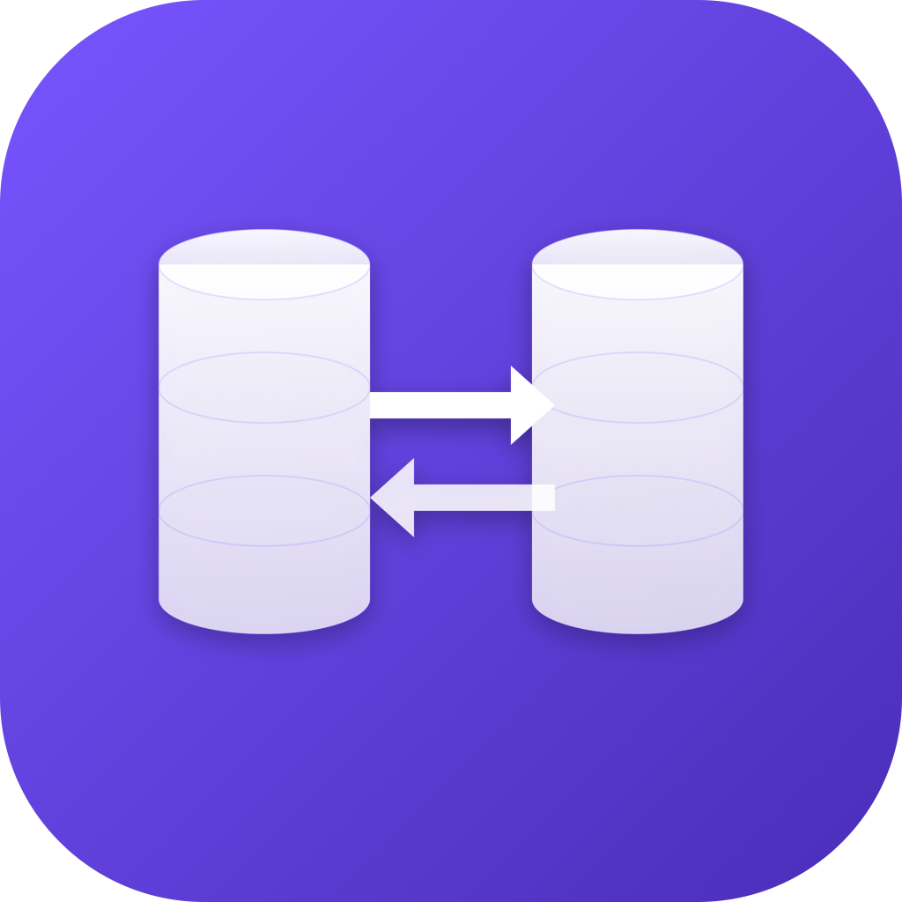

# dbferry

A native macOS desktop app for syncing tables between MySQL and PostgreSQL — manually or on a schedule. Cross-driver, streaming, and built for tables that are too big to dump.

> **MySQL ⇄ PostgreSQL** · incremental & full-table sync · cron scheduling · per-project credentials in the OS keychain · drag-and-drop project import/export



## Features

- **Cross-database** — MySQL → PostgreSQL, PostgreSQL → MySQL, or same-driver transfers.
- **Two sync modes per table**
  - **Full** — `TRUNCATE` + bulk copy, atomic per table.
  - **Incremental** — append-only, `WHERE pk > MAX(target.pk)`. Ideal for append-only logs / events.
- **Streaming engine** — `pg-cursor` on PostgreSQL, raw `mysql2` row stream on MySQL. Memory stays flat regardless of table size.
- **Fast writes** — `COPY FROM STDIN` for PostgreSQL targets, batched `INSERT IGNORE` for MySQL targets.
- **Cron scheduling** — every X minutes, every X hours, daily at HH:MM, or custom cron. Live next-run countdown.
- **Concurrency** — sync N tables in parallel per project (1–8 configurable).
- **Type coercion** — TINYINT(1) ⇄ BOOLEAN, DATETIME ⇄ TIMESTAMP, JSON/JSONB, UUID ⇄ CHAR(36), arrays.
- **OS keychain** — passwords stored via `keytar`, never written to JSON exports.
- **Project import/export** — drag a `.dbferry.json` file onto the window to import. Schema only — secrets stay in the keychain.
- **History** — last 500 sync runs with per-table row counts and timing.

## Installation

### From a release (recommended)

1. Download the latest `dbferry-x.y.z.dmg` from the [Releases page](https://github.com/ocracy/dbferry/releases).
2. Open the DMG and drag **dbferry** to **Applications**.
3. First launch: right-click the app → **Open** (the build is unsigned, so Gatekeeper will warn the first time).

Apple Silicon and Intel builds are both produced.

### From source

Requires Node.js 20+, pnpm 9+, and Xcode Command Line Tools (for native module rebuilds).

```bash
git clone https://github.com/ocracy/dbferry.git
cd dbferry
pnpm install        # builds better-sqlite3 and keytar against your local Node
pnpm dev            # starts the app in dev mode with hot reload
```

To build a distributable `.dmg`:

```bash
pnpm build:mac          # universal (arm64 + x64)
pnpm build:mac:arm64    # Apple Silicon only
pnpm build:mac:x64      # Intel only
```

Output lands in `release/`.

## How it works

1. **Create a project** — pick a source DB and a target DB. Click **Test Connection** to list databases on the server, then choose one. Enter the password (kept in the keychain). Repeat for the target.
2. **Pick tables** — open the project, hit **Refresh** to list source tables. Each table can be set to `disabled`, `incremental`, or `full`. Primary keys are auto-detected.
3. **Sync** — click **Sync now** for a one-shot, or enable the **Schedule** with a cron expression for hands-off operation.

The sync engine opens a fresh source + target connection per table (parallelized via `p-limit`), streams rows in batches of 5000, coerces values across drivers, and writes via the target's fastest bulk path. Failures are isolated to the table — other tables keep going.

## Sync semantics

- **`disabled`** — default for newly discovered tables; nothing happens.
- **`incremental`** — append-only. Only rows where the source `pk > MAX(target.pk)` are copied. Updates and deletes do **not** propagate. Requires a single integer-like primary key column. UUIDs / composite PKs are not supported in incremental mode.
- **`full`** — `TRUNCATE` + `COPY` / `INSERT` inside one transaction per table. Atomic per table; not atomic across all tables.
- **No DDL** — target tables must already exist. Column intersection is applied automatically (extra columns on either side are skipped with a warning), but type mismatches will error loudly during write.

## Architecture

```
electron/main          Electron main process: IPC, sqlite, scheduling, sync engine
  ipc/*                projects | connection | sync | history handlers
  storage/*            better-sqlite3 + migrations
  secrets/keytar.ts    OS keychain wrapper
  scheduler/cron.ts    node-cron with per-project mutex
  sync-engine/         adapters/{mysql,postgres}, type-mapper, engine
electron/preload       contextBridge → window.api (typed)
renderer/              Vite + React + Tailwind + Zustand UI
shared/                shared TypeScript types
```

## Development scripts

| Script | What it does |
| --- | --- |
| `pnpm dev` | Start Electron + renderer in dev with hot reload |
| `pnpm typecheck` | `tsc --noEmit` across the project |
| `pnpm build` | Compile main + preload + renderer to `out/` |
| `pnpm build:mac` | Build a universal `.dmg` in `release/` |
| `pnpm build:linux` | Build an `.AppImage` and `.deb` in `release/` |

## Troubleshooting

- **`The module … was compiled against a different Node.js version`** — run `npx electron-rebuild` to recompile native modules (`better-sqlite3`, `keytar`) against Electron's Node ABI. The `postinstall` script handles this for fresh installs.
- **`Access denied` on first connection** — re-enter the password in the project's settings drawer. The dialog passwords are saved to the keychain only after **Test Connection** or **Create project**.
- **`Unknown column 'id' in where clause`** — the table doesn't have an `id` primary key. Hit **Refresh** in the table list — dbferry will detect the actual PK and update it. Or set `disabled` / `full` mode for tables without an integer PK.
- **App won't open after macOS quarantine** — `xattr -dr com.apple.quarantine /Applications/dbferry.app`

## Contributing

Issues and PRs welcome. The codebase is intentionally small (~3k lines of TypeScript) and follows the conventions described in [`CLAUDE.md`](CLAUDE.md).

## License

MIT © Kerem Bekman
